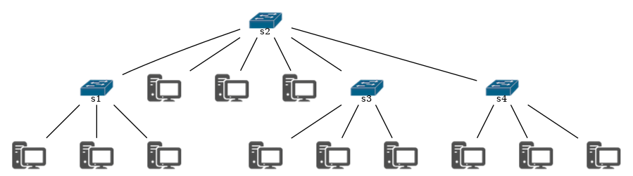

# Simulador de rede de computadores TCP/IP


## Topologia da rede a ser simulada

A rede será composta por dispositivos (na versão a ser entregue nesse projeto serão apenas *endpoint* e comutador L3) e a topologia da rede deverá ser informada por meio de um arquivo texto no momento que a aplicação é iniciada. Ou seja, o nome do arquivo que contém a topologia deverá ser informado como argumento de linha de comando. 

### Formato do arquivo texto

- Todo dispositivo deverá possuir um **identificador único**, ou seja, em uma topologia não podem existir dois dispositivos distintos compartilhando um mesmo identificador
  - *endpoints* devem iniciar com o caractere `h` sucedido de um numeral. Exemplo: `h1`
  - comutadores devem iniciar com o caractere `s` sucedido de um numeral. Exemplo: `s1`
- Cada linha do arquivo representa a conectividade entre dois dispositivos, sendo feito uso do caracteres `--` como delimitador entre os identificadores dos dois dispositivos. Exemplo: 
    ```
    idDispositivo1--idDispositivo2 
    ```
- Entre dois dispositivos quaisquer só é permitida uma única conexão. Assim, se o arquivo texto for mal constituído de forma a incluir duas ou mais linhas para representar a conectividade entre dois dispositivos, deve-se estabelecer a conectividade uma única vez e ignorar as demais linhas. Abaixo um exemplo de arquivo mal formado que contém duas linhas distintas associando os mesmos dispositivos (h1 e s1):
    ```
    h1--s1
    s1--h1
    ```

Abaixo é apresentado um exemplo de arquivo texto de uma topologia, bem como a representação gráfica da mesma.

```
h1--s1
h2--s1
h3--s1
h4--s2
h5--s2
h6--s2
s1--s2
s3--s2
s4--s2
s3--h7
s3--h8
s3--h9
h10--s4
s4--h11
h12--s4
```



> Caso queira verificar se a topologia montada está correta, use o site o [visualizador *online* para Graphviz](https://dreampuf.github.io/GraphvizOnline). Ali poderá colocar o exemplo apresentado acima dentro do escopo `graph { }`. Exemplo:
>```dot
>graph {
>    s1--h1
>}
>``` 

## Tráfego a ser simulado

Na simulação somente dispositivos do tipo *endpoint* podem ser origem ou destino de um pacote. Para efeito de simplificação, toda informação transmitida de uma origem para um destino cabe dentro de um único pacote e assuma que o endereço IP de cada dispositivo é na verdade seu **identificador único**. Sendo assim, todo pacote tem uma origem (identificador do *endpoint*, e.g. `h1`), um destino (e.g. `h2`), um TTL, um conteúdo (*payload*) e o instante da simulação que esse pacote foi gerado. 

O tráfego a ser utilizado pelo simulador deverá ser carregado por meio de um arquivo texto no momento que a aplicação é iniciada. Ou seja, o nome do arquivo que contém o tráfego deverá ser informado como argumento de linha de comando. Com exceção do instante, todos os demais campos do pacote deverão ser informados via arquivo texto. O instante será incorporado no pacote quando esse for processado pelo *endpoint* tido como origem.

### Formato do arquivo texto 

Cada linha no arquivo texto deverá conter a origem, o destino e o conteúdo do pacote, estando esses separados pelo caractere barra vertical (*pipe*) (`|`). Ex: **`origem|destino|payload`**.

Abaixo é apresentado um exemplo de arquivo texto. 

```
h1|h2|olá mundo
h2|h4|último projeto
h10|h2|férias chegando
h3|h5|fim
h7|h23|oi
```

## Simulador de eventos discretos

Assim que o aplicativo for executado, deve-se iniciar a simulação. A simulação será encerrada assim que todos os pacotes forem entregues aos seus destinos, ou descartados, caso o destino informado não seja atingível. 

Todo dispositivo deverá possuir uma fila para armazenar os pacotes que deverá processar. Em cada instante da simulação, cada dispositivo na rede deverá processar o primeiro pacote que estiver em sua fila. A fila de pacotes em cada dispositivo será povoada em dois instantes: 
- Na carga do arquivo texto; e
- Durante a execução da simulação, ou seja, sempre que receber um pacote de um outro dispositivo.  


Todo novo pacote gerado (obtido por meio do arquivo texto) deverá obrigatoriamente começar com *TTL = 3* e deverá ter o campo `instante da simulação` preenchido, sendo o simulador o único responsável por manter o valor atual do `instante da simulação`.

O comportamento de cada dispositivo para processamento de pacotes será:

-   ***endpoint*** - pega o primeiro pacote da fila e: 
    -   Se ele for a origem do pacote (indica que o pacote foi adicionado via arquivo de tráfego), então contabiliza-o como pacote gerado e o encaminha para o dispositivo com quem está conectado
        -   O pacote será criado pelo dispositivo e será composto pelos valores lidos do arquivo texto e do atual instante da simulação.
    -   Se ele for o destino do pacote, então contabiliza-o como pacote processado.
    -   Se ele não for nem o destino e nem a origem, então contabiliza-o como pacote descartado.
-   **comutador L3** - pega o primeiro pacote da fila e verifica se o destino do pacote está conectado em uma de suas portas:
    -   Se sim, então encaminha o pacote para o dispositivo e contabiliza como pacote processado.
    -   Se não, decrementa o TTL do pacote e se o novo valor for 0, então descarta o pacote e contabiliza-o  como pacote descartado. Se o TTL for maior que 0, então propagada o pacote para todos os comutadores L3 que estiverem conectados em suas portas. Ao propagar o pacote contabiliza-o como pacote processado. Se não estiver conectado com nenhum outro comutador L3, então deve-se descartar o pacote e contabiliza-lo como pacote descartado.

Todo dispositivo deverá registrar, por meio de um objeto de registro (*logger*), todo processamento que executar sobre um pacote (envio, processamento e descarte). O projeto deverá ser modelado de forma que diferentes formas de persistência (e.g. imprimir na tela, escrever em arquivo texto, escrever em arquivo binário, escrever em arquivo estruturado, escrever em banco de dados relacional etc.) possam ser usadas sem que implique em reescrever o código (programando para o mais genérico e usufruindo do polimorfismo). Ou seja, o usuário, ao executar a aplicação, poderia indicar qual forma de persistência deseja usar e nada mais precisaria ser alterado no código. 
- Nesse projeto você deverá prover implementação apenas de um objeto de registro que imprima mensagens na tela

Com o objeto de registro, deve-se registrar qual dispositivo está processando o pacote, para qual dispositivo o pacote será encaminhado e os detalhes do pacote que está sendo processado. Se o pacote for descartado, então o destino deverá ser representado pelo caractere `*`. Se o dispositivo for o destino do pacote, então como destino deve-se usar o identificador do próprio dispositivo. Assim, o objeto de persistência deve registrar linhas no seguinte formato:
  - `instante:dispositivo-que-está-processando-pacote->dispositivo-destino:[detalhes-do-pacote]`.

Por exemplo, o dispositivo `h1`, no instante de simulação `1`, processou o pacote `h1|h2|olá mundo` (obtido por meio do arquivo de tráfego, logo TTL=3). Como `h1` e `h2` estão conectados em `s1`, então no instante `2` o pacote será processado por `s1` e no instante `3` será processado por `h2`. Abaixo é apresentado um exemplo de linhas que seriam escritas pelo objeto de persistência em um arquivo para a seguinte topologia e tráfego:

Topologia:
```
h1--s1
h2--s1
h3--s1
```
Tráfego:
```
h1|h2|olá mundo
h2|h3|último projeto
h1|h4|fim
```

Resultado no arquivo gerado pelo objeto de persistência:
```
1:h1->s1:[h1|h2|olá mundo:3|1]
1:h2->s1:[h2|h3|último projeto|1]
2:s1->h2:[h1|h2|olá mundo:3|1]
2:h1->s1:[h1|h4|fim|2]
3:s1->h3:[h2|h3|último projeto|1]
3:h2->h2[h1|h2|olá mundo:3|1]
4:h3->h3[h2|h3|último projeto|1]
4:s1->*[h1|h4|fim|2]
``` 

Ao término da simulação deve-se imprimir na tela um resumo indicando o total de pacotes que foi processado por cada dispositivo presente na rede. Seguindo o exemplo anterior, teríamos o seguinte resumo:

```
Fim da simulação, que demorou 4 instantes
|---------------------------------------------------|
| Dispositivo |             Pacotes                 |
|             | gerados | processados | descartados |
|---------------------------------------------------|
| h1          |       2 |           0 |           0 |
| h2          |       1 |           1 |           0 |
| h3          |       0 |           1 |           0 |
| s1          |       0 |           2 |           1 |
|---------------------------------------------------|
```


## Como executar

```bash
# Clone this project
$ git clone https://github.com/faber222/Network_Simulator.git

# Access
$ cd Network_Simulator

# Make sure you have the files of "Topology" and "Traffic" created
# For run, just write the file name of then, and include de log name
$ java -jar {topologyNetworkFile.txt} {dataTrafficFile.txt} {logNameFile.txt}
```